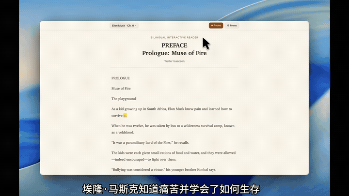
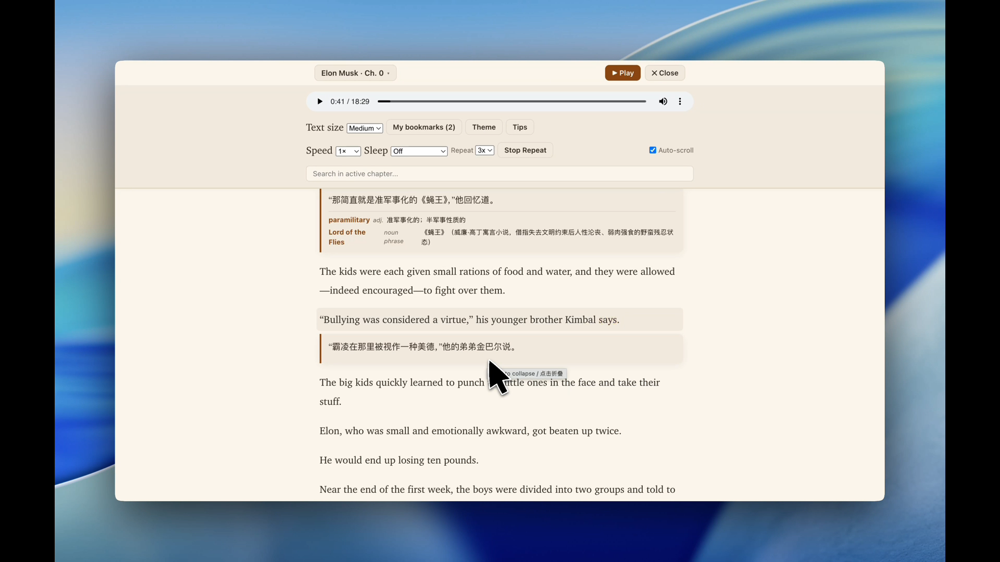
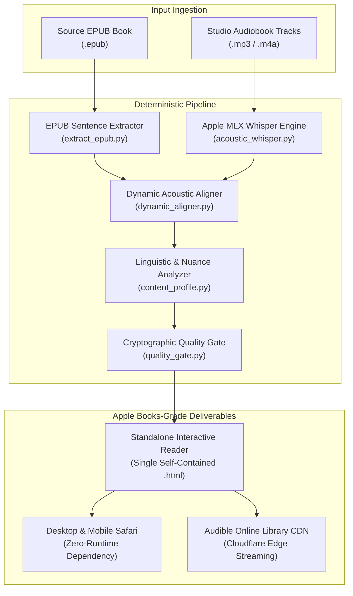

# Interactive Audiobook Reader Pipeline

**The Apple Books-grade Interactive Bilingual Reader & Audiobook Engine, built specifically for macOS & Apple Silicon.**

[](https://audiblelibrary.online/books/the-psychology-of-money/)
[](https://apple.com)
[-orange.svg?style=flat-square)](https://apple.com)
[](https://github.com/ml-explore/mlx)
[](https://github.com/chase-yuan/interactive-audiobook-reader-pipeline)
[](LICENSE)

---

A deterministic, industrial-strength pipeline for converting any EPUB book into a standalone, zero-dependency bilingual reading experience with Apple Books typography, word-level acoustic synchronization, bilingual contextual breakdown, and cryptographic release verification.

> 🚀 **Live Production Demo**: Try the interactive reader immediately in your browser at **[audiblelibrary.online](https://audiblelibrary.online/books/the-psychology-of-money/)** (no installation or setup required).

---

## Interactive Experience & Visual Showcase



- **Word-Level Acoustic Synchronization**: Smooth, real-time word highlighting tracking professional studio audiobook narration.
- **Click-to-Translate & Nuance Cards**: Click any sentence to reveal idiomatic Chinese translation alongside contextual CEFR C1/C2 vocabulary breakdowns with parts of speech and phonetics.
- **Apple Books-Grade Aesthetics**: Powered by responsive New York/San Francisco serif type stacks, 44px Apple HIG touch targets, and instant Light, Sepia, and Pure Black OLED Dark mode switching.



---

## Why macOS & Apple Silicon?

- **Zero-Dependency Standard Library Core**: Pure text interactive readers require **zero external dependencies** — executing entirely on native Python 3.9+ standard library modules.
- **Apple Silicon Unified Memory Acceleration**: Speech-to-text forced alignment uses Apple's official `mlx-whisper`, executing on the Mac's unified memory, Neural Engine, and GPU with zero CUDA bloat and zero cloud API billing.
- **Acoustic Benchmark Matrix**:

| Hardware Platform | Audio Track Length | MLX Alignment Time | Processing Throughput | Cloud API Cost |
| :--- | :---: | :---: | :---: | :---: |
| **Apple M4 / M3 Max (Unified Memory)** | 1 Hour (Studio Audio) | **~2.2 min** | **~27x Real-time** | **$0.00 (Offline)** |
| **Apple M3 / M2 Pro** | 1 Hour (Studio Audio) | **~3.5 min** | **~17x Real-time** | **$0.00 (Offline)** |
| **Apple M1 / M2 Air** | 1 Hour (Studio Audio) | **~4.8 min** | **~12x Real-time** | **$0.00 (Offline)** |
| Cloud GPU / REST ASR API | 1 Hour (Studio Audio) | ~6–10 min + Latency | ~7x Real-time | $0.36 – $1.20 / book |

- **Native macOS Workflow**: Automatic Safari browser launch (`open`) upon compilation completion, with instant artifact delivery paths copied via `pbcopy`.

---

## System Architecture



---

## Quickstart (30 Seconds on Mac)

Clone the repository and build the included public-domain demo (*Sun Tzu's The Art of War*) in 5 seconds:

```bash
# 1. Clone the repository
git clone https://github.com/chase-yuan/interactive-audiobook-reader-pipeline.git
cd interactive-audiobook-reader-pipeline

# 2. Build the interactive bilingual reader (Zero external dependencies needed)
python3 universal_runner.py demo/sample.epub --text-only
```

Your default browser (Safari) will automatically open displaying the completed standalone interactive reader.

---

## Dual-Mode Operation

### 1. Pure Text Interactive Reader (`text_only`)
Ideal for books without audiobooks. Generates complete chapter-by-chapter bilingual readers with sentence click-to-translate, interactive vocabulary popups, and keyboard navigation.

```bash
# Basic run with auto-detected output directory:
python3 universal_runner.py /path/to/book.epub --text-only

# High-throughput parallel translation (e.g. 8 workers):
python3 universal_runner.py /path/to/book.epub --text-only --concurrency 8 --book-dir ./my_book
```

### 2. Immersive Studio Audiobook (`complete`)
Combines EPUB text with professional narrator audio tracks (`.mp3`), performing word-by-word forced alignment via Apple Silicon MLX Whisper.

```bash
# Install Apple Silicon MLX acoustic support:
pip install -e '.[acoustic]'

# Build complete audiobook reader:
python3 universal_runner.py --epub /path/to/book.epub --audio-dir /path/to/mp3s --book-dir ./my_book
```

---

## CLI Installation

Install into your local Python environment to use the `reader-build` command anywhere on your Mac:

```bash
# Standard setup (Text-only readers)
pip install -e .

# Full setup (Apple Silicon MLX acoustic engine + publication tools)
pip install -e '.[acoustic,deployment]'
```

Once installed, simply run:

```bash
reader-build /path/to/book.epub --text-only
```

---

## Input Structure & Audio Mapping

The pipeline automatically inspects and pairs EPUB chapters with audio tracks:

- `my_book_sources/`
  - `book.epub`: Source EPUB containing the chapter spine.
  - `audio/`: Directory containing narrated audio files:
    - `00_preface.mp3`: Mapped to Chapter 0 / Preface
    - `01_chapter1.mp3`: Mapped to Chapter 1
    - `02_chapter2.mp3`: Mapped to Chapter 2

The runner aligns tracks by numerical prefix or spine ID, ensuring 100% monotonicity and zero audio-text drift across the entire monograph.

---

## Project Structure

- `universal_runner.py`: Primary CLI entrypoint (`reader-build`)
- `extract_epub.py`: Clean EPUB sentence boundary extractor
- `dynamic_aligner.py`: High-precision word-level acoustic aligner
- `html_builder.py`: Apple Books-grade standalone HTML compiler
- `content_profile.py`: Mode router (`text_only` vs `complete` audio)
- `quality_gate.py`: Cryptographic release gate & smoke tester
- `validate_outputs.py`: Invariant validator for publication
- `acoustic_whisper.py`: Apple Silicon MLX Whisper extractor
- `demo/sample.epub`: Minimal 5KB public-domain demo EPUB
- `docs/images/`: Visual demo GIFs and UI showcases
- `docs/history/`: Archive of milestone specs and benchmarks
- `requirements.txt`: Standard macOS pip requirements
- `setup.py`: Package configuration & console scripts
- `LICENSE`: MIT License

---

## Quality Verification

Run the comprehensive unit and integration test matrix (138 assertions):

```bash
python3 -m unittest discover
```

---

## License

This project is licensed under the [MIT License](LICENSE).
