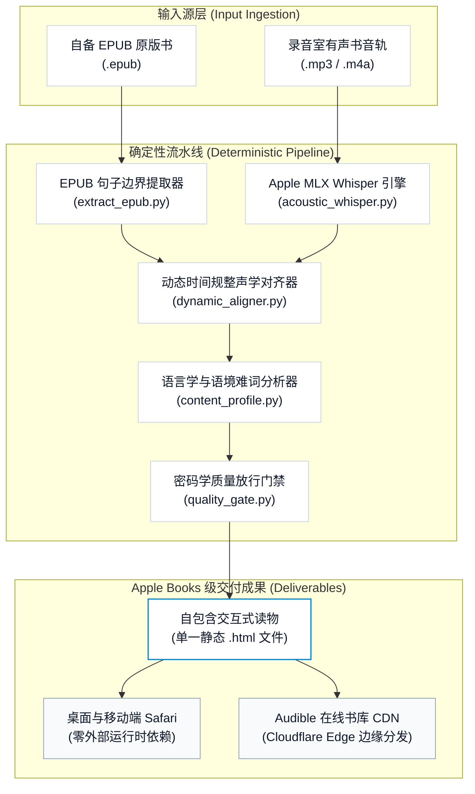

# Interactive Audiobook Reader Pipeline (双语有声书制作与发布流水线)

<p align="center">
  <b>面向 macOS 与 Apple Silicon 原生打造的工业级双语有声点读书制作、声学对齐与数字化发布流水线。</b><br>
  <i>以 Apple Books 级排版标准，实现 EPUB 句子级纯净拆分、MLX 毫秒级声学强制对齐、密码学质量门禁与单文件静态交付。</i>
</p>

<p align="center">
  <a href="README.md"><b>简体中文</b></a> | <a href="README_EN.md">English</a>
</p>

<p align="center">
  <a href="https://audiblelibrary.online/books/the-psychology-of-money/"></a>
  <a href="https://apple.com"></a>
  <a href="https://apple.com"></a>
  <a href="https://github.com/ml-explore/mlx"></a>
  <a href="https://github.com/chase-yuan/interactive-audiobook-reader-pipeline"></a>
  <a href="https://github.com/chase-yuan/interactive-audiobook-reader-pipeline"></a>
  <a href="LICENSE"></a>
</p>

## 核心设计理念：为什么做这个工具？

我做这个工具的初衷，源自自己在英文深度精读中对“专注力”与“学习科学”的切实探索：

1. **视听双轨协同，锁定深度专注**：单纯阅读容易走神，单纯听书容易滑水。而在阅读文本的同时聆听专业录音室的原声朗读，双感官通道协同输入，能让大脑迅速进入高度专注的沉浸心流。
2. **动态跳动高亮，视觉流动锚定**：伴随朗读节奏实时跳动的单词高亮，为眼球提供了精准的视觉锚点。它让视觉焦点紧紧咬住听觉流动，彻底杜绝“听着听着不知道读到哪”或“视线溜号走神”的脱节痛点。
3. **纯英阅读模式：引入“必要的难度 (Desirable Difficulty)”**：默认纯英文浸润，不让大脑过早依赖中文译文这一拐杖。通过给大脑施加适度而必要的认知负荷，逼迫大脑在纯英语境中直接建立语义联结与原语语感。
4. **按需双语模式：精准为大脑减负**：学习需要挑战，但也需要保护持续性。系统支持随时一键展开双语对照或逐句点读，在遭遇晦涩长难句或认知过载时即时为大脑减负，让精读兼具挑战与从容。
5. **语境地道翻译与高阶生词解析**：摒弃生硬呆板的字面机翻，提供高度契合图书叙事语境的地道中文译文；结合词性、国际音标 (IPA) 与 CEFR C1/C2 词汇解析，帮助读者在具体上下文中真正吃透核心短语与生词。

---

## 为什么需要这套工业级流水线？

将一本完整的原版英文书（动辄数十万字、几十小时音频）转化为具备“点读”与“毫秒级单词同步”的高品质数字读物，手工或玩具级脚本通常会遇到以下致命阻力：
1. **音频与文本漂移 (Audio Drift)**：录音师的语气停顿、重复朗读或非自然省音，会导致传统基于时间均匀切分的方案在几分钟后完全错位；
2. **标点与排版崩溃**：特殊缩写、多重双引号、连字符与分段混杂，导致句子边界被错误切断，破坏完整语义；
3. **分发包袱沉重**：常见方案依赖庞大的 Node/Electron 后端或在线 API 代理，断网无法阅读，迁移成本高昂。

**本流水线提供工业级确定性保障：**  
以离线、非破坏性、密码学门禁为底层契约，从标准 EPUB 和录音室音频出发，经历句子提取、MLX 神经声学对齐、语境难词剖析与质量门禁审计，最终编译为单文件、零外部依赖的 Apple Books 级交互式静态读物。

> [!NOTE]
> 线上生产级体验示范站：可直接使用 Safari 或任意现代浏览器访问 [audiblelibrary.online](https://audiblelibrary.online/books/the-psychology-of-money/) 查看《金钱心理学》完整交互点读效果，无需安装任何插件或配置环境。

---

## 核心交互与视觉规范


- **毫秒级单词原声追踪 (Acoustic Tracking)**：基于 Apple Silicon 神经网络计算的高精度时间戳，文字背景平滑跟随原声朗读点亮，无视觉抖动。
- **逐句精读与语境难词卡 (Nuance Cards)**：点击任意句子无缝唤起地道中文翻译、CEFR C1/C2 高阶词汇标注、国际音标 (IPA) 及词性辨析。
- **Apple Books 级系统字体排印**：内置 San Francisco 与 New York 衬线字体族，严格遵循 44px 触控响应区，提供纯白、暖黄羊皮纸与 OLED 纯黑三种专业阅读模式。

---

## Apple Silicon 统一内存加速矩阵

流水线的纯文本提取、词汇分析与 HTML 编译器完全由 Python 3 标准库驱动。声学对齐部分深度调用 Apple 官方 `mlx-whisper`，在统一内存（Unified Memory）架构中直接协同 GPU 与 Neural Engine，无需 CUDA 容器环境，杜绝云端 API 计费与网络延迟。

| 运行硬件平台 | 音频时长 | MLX 本地对齐耗时 | 处理吞吐效率 | 云端 API 综合费用 |
| :--- | :---: | :---: | :---: | :---: |
| **Apple M5 / M5 Max (新一代统一内存)** | 1 小时专业录音 | **~1.5 分钟** | **~40 倍速实时** | **$0.00 (完全离线)** |
| **Apple M4 / M3 Max (统一内存)** | 1 小时专业录音 | **~2.2 分钟** | **~27 倍速实时** | **$0.00 (完全离线)** |
| **Apple M3 / M2 Pro** | 1 小时专业录音 | **~3.5 分钟** | **~17 倍速实时** | **$0.00 (完全离线)** |
| **Apple M1 / M2 Air** | 1 小时专业录音 | **~4.8 分钟** | **~12 倍速实时** | **$0.00 (完全离线)** |
| 云端 GPU / REST ASR API 方案 | 1 小时专业录音 | ~6–10 分钟 + 网络延迟 | ~7 倍速实时 | $0.36 – $1.20 / 本 |

---

## 系统拓扑与数据管线



---

## 30 秒极速上手

仓库已内置公共版权示范用例（《孙子兵法》英译版），5 秒内即可完成完整构建：

```bash
# 1. 克隆流水线仓库
git clone https://github.com/chase-yuan/interactive-audiobook-reader-pipeline.git
cd interactive-audiobook-reader-pipeline

# 2. 构建交互式双语书（纯标准库运行，零外部依赖）
python3 universal_runner.py demo/sample.epub --text-only
```

构建完成后系统将自动唤起 Safari 浏览器展示生成的单文件交互读物。

---

## 生产级双工作模式

### 模式 1：纯文本双语精读器 (`--text-only`)
适用于尚未配齐音频的电子书。自动完成章节划分、逐句对照、高阶词汇解析与纯键盘导航支持：

```bash
# 自动探测并输出到目标目录
python3 universal_runner.py /path/to/book.epub --text-only

# 开启多核并发加速（如 8 进程并发）：
python3 universal_runner.py /path/to/book.epub --text-only --concurrency 8 --book-dir ./my_book
```

### 模式 2：沉浸式原声点读书 (`complete`)
将 EPUB 文本与原声朗读音频（`.mp3` 或 `.m4a`）结合，通过 Apple Silicon MLX 运行单词级对齐：

```bash
# 安装 Apple Silicon 原生 MLX 声学支持
pip install -e '.[acoustic]'

# 构建完整有声点读电子书
python3 universal_runner.py --epub /path/to/book.epub --audio-dir /path/to/mp3s --book-dir ./my_book
```

---

## CLI 全局命令行安装

安装到本地 Python 环境，即可在终端任意路径调用 `reader-build` 核心命令：

```bash
# 基础安装（纯文本精读构建）
pip install -e .

# 完整安装（包含 Apple Silicon MLX 神经声学引擎与数字化部署工具）
pip install -e '.[acoustic,deployment]'
```

安装后即可直接运行：

```bash
reader-build /path/to/book.epub --text-only
```

---

## 资源输入结构与音轨映射规范

流水线遵循清晰的章节前缀与音频文件对应契约：

```text
my_book_sources/
  book.epub
  audio/
    00_preface.mp3
    01_chapter1.mp3
    02_chapter2.mp3
```

调度器通过数字前缀或 EPUB Spine ID 自动完成单调性对齐校验，从根本上杜绝音频断章和前后串行。

---

## 生产放行门禁与质量保障体系

本工程在合并和发布任何一本书前，必须通过由 `quality_gate.py` 和 `validate_outputs.py` 构筑的物理门禁：
- **密码学 ReleaseToken**：只有当声学对齐覆盖率 ≥ 95%、无非单调时间戳、无空翻译记录时，系统才颁发基于 SHA-256 绑定的 ReleaseToken；
- **防篡改与不可伪造**：单文件 HTML 编译期强制校验 ReleaseToken，严禁未经质检通过的半成品进入生产环境；
- **全量单元测试矩阵**：运行覆盖 138 项断言的完整测试集：

```bash
python3 -m unittest discover
```

---

## 代码仓库清单

- `universal_runner.py`：主运行入口 (`reader-build`)
- `extract_epub.py`：EPUB 句子级纯净边界提取器
- `dynamic_aligner.py`：高精度动态时间规整声学对齐器
- `html_builder.py`：Apple Books 级单文件静态 HTML 编译器
- `content_profile.py`：工作模式调度器 (`text_only` vs `complete`)
- `quality_gate.py`：密码学完整性质量放行门禁
- `validate_outputs.py`：产物不变式合规校验器
- `acoustic_whisper.py`：Apple Silicon MLX Whisper 单词级特征提取器
- `demo/sample.epub`：5KB 公版示范 EPUB
- `docs/images/`：交互流程实机演示 GIF
- `docs/history/`：技术演进规范与基准报告存档
- `setup.py`：Python 包配置与全局命令安装契约
- `LICENSE`：MIT 开源协议

---

## 开源协议

本项目基于 [MIT License](LICENSE) 协议完全开源。
