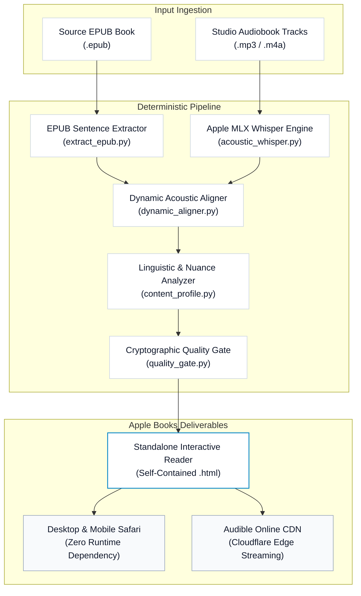

# Interactive Audiobook Reader Pipeline

<p align="center">
  <b>The Apple Books-grade bilingual interactive reader and acoustic synchronization pipeline, engineered natively for macOS and Apple Silicon.</b>
</p>

<p align="center">
  <a href="README.md">简体中文</a> | <a href="README_EN.md"><b>English</b></a>
</p>

<p align="center">
  <a href="https://audiblelibrary.online/books/the-psychology-of-money/"></a>
  <a href="https://apple.com"></a>
  <a href="https://apple.com"></a>
  <a href="https://github.com/ml-explore/mlx"></a>
  <a href="https://github.com/chase-yuan/interactive-audiobook-reader-pipeline"></a>
  <a href="https://github.com/chase-yuan/interactive-audiobook-reader-pipeline"></a>
  <a href="LICENSE"></a>
</p>

---

A deterministic, industrial-strength pipeline for compiling any standard EPUB into a self-contained bilingual reading application. Delivers Apple Books typography, word-level acoustic synchronization, contextual CEFR vocabulary parsing, and cryptographic release verification with zero external runtime dependencies.

> [!NOTE]
> Experience the production interactive reader directly in Safari or any modern browser at [audiblelibrary.online](https://audiblelibrary.online/books/the-psychology-of-money/). Zero installation, accounts, or extensions required.

---

## Core Design Philosophy: Why Build This Tool?

This project was born out of a personal exploration into focus and cognitive learning science during deep bilingual reading:

1. **Dual-Modal Immersion for Laser Focus**: Reading alone often leads to mind-wandering; passive listening often leads to zone-outs. By reading the text while simultaneously listening to studio narration, dual-channel sensory input locks cognitive bandwidth into deep, sustained immersion.
2. **Kinetic Word Tracking as a Visual Anchor**: Real-time highlighting that dynamic leaps word-by-word with the audio narration provides an unshakeable visual anchor, completely eliminating the cognitive friction of losing one's place or trailing off.
3. **Pure English Mode: Embracing "Desirable Difficulty"**: By keeping the interface in pure English by default, the brain is deprived of premature crutches. This introduces the cognitive psychological concept of *desirable difficulty*, training the mind to process English directly in context.
4. **On-Demand Bilingual Mode: Dynamic Cognitive Unloading**: Effective learning requires challenge without burnout. The reader allows seamless toggle between pure English and sentence-level bilingual translation on demand, unloading cognitive fatigue during dense chapters.
5. **Contextual Idiomatic Translation & Nuance Breakdown**: Moving beyond rigid machine translation, nuance cards provide literary-grade idiomatic translations alongside CEFR C1/C2 vocabulary annotations, parts of speech, and phonetic IPA transcripts, helping readers truly absorb vocabulary in its living context.

---

## Interactive Experience


- **Acoustic Tracking**: Real-time word highlighting locked to studio audiobook narration with sub-millisecond precision.
- **Nuance Cards**: Instant contextual sentence translations with CEFR C1/C2 vocabulary breakdowns, phonetic IPA transcripts, and lexical annotations.
- **Apple Books Typography**: Native San Francisco and New York serif type stacks, 44 px touch targets, and instant Light, Sepia, and OLED Dark mode switching.

---

## Apple Silicon Performance

The text extraction, analysis, and single-file HTML compiler execute entirely on native Python 3 standard library modules. Speech-to-text forced alignment executes via Apple's official `mlx-whisper`, utilizing unified memory, GPU, and Neural Engine acceleration without CUDA bloat or cloud API latency.

| Execution Target | Audio Duration | Processing Time | Throughput | API Cost |
| :--- | :---: | :---: | :---: | :---: |
| **Apple M5 / M5 Max (Next-Gen Unified Memory)** | 1 Hour (Studio Audio) | **~1.5 min** | **~40x Real-time** | **$0.00 (Offline)** |
| **Apple M4 / M3 Max (Unified Memory)** | 1 Hour (Studio Audio) | **~2.2 min** | **~27x Real-time** | **$0.00 (Offline)** |
| **Apple M3 / M2 Pro** | 1 Hour (Studio Audio) | **~3.5 min** | **~17x Real-time** | **$0.00 (Offline)** |
| **Apple M1 / M2 Air** | 1 Hour (Studio Audio) | **~4.8 min** | **~12x Real-time** | **$0.00 (Offline)** |
| Cloud GPU / REST ASR API | 1 Hour (Studio Audio) | ~6–10 min + Latency | ~7x Real-time | $0.36 – $1.20 / Title |

---

## System Architecture



---

## Quickstart

Build the included public-domain monograph (*Sun Tzu's The Art of War*) in 5 seconds using standard library Python:

```bash
# 1. Clone the repository
git clone https://github.com/chase-yuan/interactive-audiobook-reader-pipeline.git
cd interactive-audiobook-reader-pipeline

# 2. Build the interactive reader (Zero external dependencies)
python3 universal_runner.py demo/sample.epub --text-only
```

The completed standalone interactive reader automatically opens in Safari.

---

## Operational Modes

### 1. Pure Text Reader (`text-only`)
For volumes without audiobook recordings. Generates complete chapter-by-chapter bilingual readers with sentence click-to-translate, interactive vocabulary popups, and keyboard navigation.

```bash
# Basic run with auto-detected output directory
python3 universal_runner.py /path/to/book.epub --text-only

# High-throughput parallel translation (8 workers)
python3 universal_runner.py /path/to/book.epub --text-only --concurrency 8 --book-dir ./my_book
```

### 2. Immersive Studio Audiobook (`complete`)
Combines EPUB text with professional narrator audio tracks (`.mp3` or `.m4a`), performing word-by-word forced alignment via Apple Silicon MLX Whisper.

```bash
# Install Apple Silicon MLX acoustic engine
pip install -e '.[acoustic]'

# Build complete synchronized audiobook reader
python3 universal_runner.py --epub /path/to/book.epub --audio-dir /path/to/mp3s --book-dir ./my_book
```

---

## Installation

Install into your local Python environment to use the `reader-build` command directly:

```bash
# Standard setup (Text-only readers)
pip install -e .

# Full setup (Apple Silicon MLX acoustic engine and deployment tools)
pip install -e '.[acoustic,deployment]'
```

Once installed:

```bash
reader-build /path/to/book.epub --text-only
```

---

## Ingestion Directory Layout

The pipeline automatically inspects and pairs EPUB chapters with audio tracks:

```text
my_book_sources/
  book.epub
  audio/
    00_preface.mp3
    01_chapter1.mp3
    02_chapter2.mp3
```

Tracks are aligned by numerical prefix or spine ID, guaranteeing monotonic audio-text alignment across the entire volume.

---

## Repository Structure

- `universal_runner.py`: Primary CLI entrypoint (`reader-build`)
- `extract_epub.py`: EPUB sentence boundary extractor
- `dynamic_aligner.py`: High-precision word-level acoustic aligner
- `html_builder.py`: Standalone Apple Books HTML compiler
- `content_profile.py`: Mode router (`text_only` vs `complete` audio)
- `quality_gate.py`: Cryptographic release gate and smoke tester
- `validate_outputs.py`: Invariant validator for publication
- `acoustic_whisper.py`: Apple Silicon MLX Whisper extractor
- `demo/sample.epub`: Public-domain demo EPUB
- `docs/images/`: Visual assets and interactive flow demonstrations
- `docs/history/`: Historical milestone specifications and benchmarks
- `setup.py`: Package configuration and entrypoints
- `LICENSE`: MIT License

---

## Verification Matrix

Execute the comprehensive test matrix (138 assertions covering extraction, alignment, and packaging):

```bash
python3 -m unittest discover
```

---

## License

This project is licensed under the [MIT License](LICENSE).
